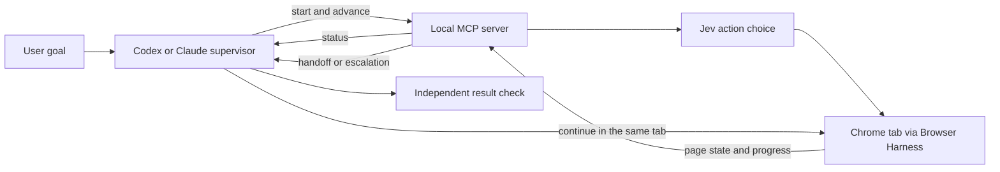

# Jev Ultrafast Computer Use

Give a fast browser agent the routine page work while a reasoning agent stays in charge.

This project builds on [Browser Use's jev-ultrafast](https://github.com/browser-use/jev-ultrafast). Its core loop turns a Chrome page into indexed controls, asks [TypeSafe's Jev](https://docs.typesafe.ai/introduction) to choose an action, and executes only a supported action on an observed control. This repository keeps that loop and adds a local MCP server so Codex or Claude can start a run, inspect progress, supply missing text, and take over the same tab. It is an independent extension, not an official Browser Use or TypeSafe release. The original MIT license and Browser Use copyright notice remain in [LICENSE](LICENSE).

## Goal

Use Jev for quick, low-cost browser decisions. Let Codex or Claude handle the parts that need more judgment: choosing the goal, watching the run, resolving uncertainty, taking over, and checking the result. This can reduce the number of slow model decisions in a browsing task without giving up the supervising agent's control.

## How it works



The MCP server exposes six tools:

| Tool | Purpose |
| --- | --- |
| `start_browse` | Open a public HTTPS page and start a Jev run. |
| `advance_browse` | Run a bounded number of actions and return progress. |
| `browse_status` | Read the current page and recent actions without acting. |
| `submit_browse_text` | Supply text when Jev selects a field and the supervisor has the value. |
| `handoff_browse` | Stop Jev and release its Chrome tab to the supervisor. |
| `close_browse` | Close a tab still owned by Jev. |

`advance_browse` returns `ready`, `needs_text`, `needs_gpt`, or `needs_verification`. A low-confidence choice can trigger handoff through `min_confidence`. A blocked run or error also hands off. On handoff, Jev stops controlling the tab; the supervisor claims that tab with its own Chrome controls and checks the URL and title before continuing. Jev's `DONE` choice is never treated as proof that the task succeeded.

One [shared skill](skills/jev-browser/SKILL.md) teaches this workflow to both Codex and Claude. The plugin includes the same Python MCP server for both clients. The client manifests differ only where their plugin formats require it.

## Current scope

This first version is for public, read-only browsing in local Chrome. It accepts public HTTPS starting URLs. It does not automate private account pages, purchases, uploads, or native desktop apps. Jev sends visible page text to TypeSafe. The optional text helper receives field context if configured. See [TODOS.md](TODOS.md) for native app computer use and other planned work.

## Set up

You need macOS with Chrome, [uv](https://docs.astral.sh/uv/), a [TypeSafe API key](https://console.typesafe.ai/), and a Codex or Claude installation with local plugin support. The plugin runs on your computer so it can reach your Chrome profile.

```bash
git clone https://github.com/dovstern/jev-ultrafast-computer-use.git
cd jev-ultrafast-computer-use
uv sync --locked
```

Set `TYPESAFE_API_KEY` in your shell environment. Keep it out of the repository. The launcher also reads it from interactive zsh when a desktop agent did not inherit the variable. For Jev's `TYPE_TEXT` operation, either let the supervisor answer `needs_text`, or configure the optional text model variables shown in [.env.example](.env.example).

Enable Chrome Remote Debugging in `chrome://inspect/#remote-debugging`, then check the connection:

```bash
uv run browser-harness --doctor
```

Remote Debugging lets local programs attached to Chrome inspect and control its tabs. Use a Chrome profile you intend to make available to this tool.

### Codex

Add this repository as a plugin marketplace, then install **Jev Ultrafast Computer Use** from the Codex desktop Plugins Directory:

```bash
codex plugin marketplace add dovstern/jev-ultrafast-computer-use
```

Start a new Codex task after installation so it loads the skill and MCP tools. If you already registered `jev-browser` with `codex mcp add`, remove that older standalone registration after the plugin works to avoid two copies of the tools.

### Claude Code

```bash
claude plugin marketplace add dovstern/jev-ultrafast-computer-use
claude plugin install jev-ultrafast-computer-use@jev-ultrafast-computer-use
```

Start a new Claude Code session. You can also load this checkout for development with `claude --plugin-dir .`.

Ask either agent to browse a public site with Jev. The supervisor should use the MCP tools, check progress, and verify the final page. When Jev cannot finish, the agent can continue in the tab Jev left open.

## Upstream project and evidence

The action-selection loop, browser adapter, examples, demo assets, and [performance report](docs/performance.md) come from [browser-use/jev-ultrafast](https://github.com/browser-use/jev-ultrafast). Its reported speed measurements concern those upstream tasks. They are not a benchmark of this MCP handoff or of other websites.

## Next steps

The main next step is a native app adapter. It would present observable app controls to Jev as indexed actions while Codex or Claude supervises and can take over. That work is tracked in [TODOS.md](TODOS.md). The current plugin makes no native app claim.

## Contributing

Issues and pull requests are welcome. Keep changes general rather than adding site-specific plans or fixed field values. Never commit API keys or browser data. Run the project checks before opening a PR:

```bash
uv run ruff check .
uv run pytest
node --check jev_ultrafast/static/app.js
node --check jev_ultrafast/snapshot.js
uv build
```

Changes to `main` require a pull request and approval from the repository owner, `@dovstern`. Keep the Browser Use copyright and MIT notice when reusing the upstream code.

## License

[MIT](LICENSE).
