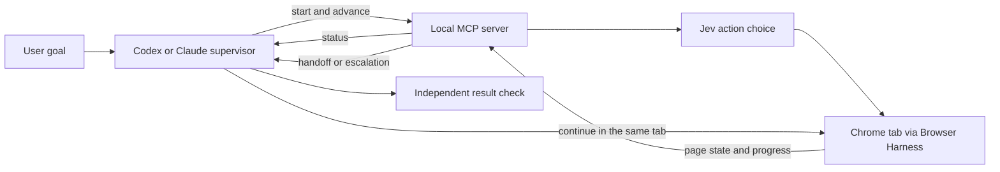

# Jev Ultrafast Computer Use

Give a fast browser agent the routine page work while a reasoning agent stays in charge.

This project builds on [Browser Use's jev-ultrafast](https://github.com/browser-use/jev-ultrafast). Its core loop turns a Chrome page into indexed controls, asks [TypeSafe's Jev](https://docs.typesafe.ai/introduction) to choose an action, and executes only a supported action on an observed control. This repository installs that upstream Python package from Git and adds a separate local MCP bridge. Codex or Claude can start a run, inspect progress, supply missing text, and take over the same tab. It is an independent extension, not an official Browser Use or TypeSafe release. The original MIT license and Browser Use copyright notice remain in [LICENSE](LICENSE).

## Goal

Use Jev for quick, low-cost browser decisions. Let Codex or Claude handle the parts that need more judgment: choosing the goal, watching the run, resolving uncertainty, taking over, and checking the result. This can reduce the number of slow model decisions in a browsing task without giving up the supervising agent's control.

## How it works



The MCP server exposes seven tools:

| Tool | Purpose |
| --- | --- |
| `start_browse` | Open a public or authorized signed-in HTTPS page and start a Jev run. |
| `advance_browse` | Run a bounded number of actions and return progress. |
| `browse_status` | Read the current page and recent actions without acting. |
| `submit_browse_text` | Supply text when Jev selects a field and the supervisor has the value. |
| `guide_browse` | Choose an observed action during a guidance pause, then return control to Jev. |
| `handoff_browse` | Stop Jev and release its Chrome tab to the supervisor. |
| `close_browse` | Close a tab still owned by Jev. |

`advance_browse` returns `ready`, `needs_text`, `needs_guidance`, `needs_gpt`, or `needs_verification`. Ordinary calls omit `min_confidence`: Jev runs with no confidence-based pause. Use an explicit override only when debugging or when the human asks for a particular threshold. A low-confidence override can return `needs_guidance` when `allow_guidance=True`; the supervisor then calls `guide_browse` with a supported operation and current observed control index. Without guidance, it hands off. For `TYPE_TEXT`, supply the value through `needs_text`.

Start a run with `sensitive=True` when it may reach a sensitive decision. The mode stays active for the whole run and applies a **0.2 confidence minimum** to both the operation and selected target. A higher explicit override is allowed; a lower one cannot reduce that minimum. The mode also adds instructions to every Jev decision: continue authorized navigation and inspection, but choose `BLOCKED` before entering or submitting personal/payment information, buying or committing money, changing accounts or permissions, publishing/uploading, deleting, or accepting consequential terms. On handoff, the slower reasoning supervisor reviews the step and surfaces any required human approval. The mode does not authorize those actions. Its instruction is a model policy, not a guarantee that a sensitive action cannot execute.

Status includes `sensitive`, indexed controls, supported operations, and selected field values. Controls that had no effect are excluded until the page changes. The browser wrapper exposes visible labels for styled native radio buttons and checkboxes and checks the linked input before clicking. It excludes covered controls and briefly retries observations while the page changes. These retries never repeat input. An invalid TypeSafe decision response gets one fresh prediction attempt before handoff; validation stays enabled. A blocked run or error also hands off. The supervisor claims the activated tab, checks its URL and title, and continues or verifies independently. Jev's `DONE` choice is never treated as proof that the task succeeded.

Upstream Jev uses `TEXT_MODEL_API_KEY` for its optional text model when it selects `TYPE_TEXT`. This bridge does not require that key. Without it, `advance_browse` pauses **before** the upstream text-model call and returns `needs_text` with the selected field and page context. Codex or Claude writes the value and calls `submit_browse_text`; the bridge passes that exact value to upstream Jev for the pending action. Jev still uses `TYPESAFE_API_KEY` to choose browser actions. Setting `TEXT_MODEL_API_KEY` opts into upstream automatic text generation instead.

One [shared skill](skills/jev-browser/SKILL.md) teaches this workflow to both Codex and Claude. The plugin includes the same Python MCP server for both clients. The client manifests differ only where their plugin formats require it.

## Current scope

The plugin supports authorized read-only browsing of public and signed-in private account pages in local Chrome. It uses the connected Chrome profile and its existing sessions. Jev sends visible page text, including account content, to TypeSafe. The optional text helper receives field context if configured. The user must authorize account access and that data sharing. Purchases, account changes, uploads, and native desktop apps remain outside this workflow.

The URL check requires HTTPS and a dotted hostname. It rejects literal IP addresses, hostnames ending in `.local`, `.internal`, or `.test`, and credentials embedded in URLs. It does not check whether a page is signed in or enforce read-only actions; the supervisor controls the task scope. See [TODOS.md](TODOS.md) for native app computer use and other planned work.

## Set up

You need macOS with Chrome, [uv](https://docs.astral.sh/uv/), a [TypeSafe API key](https://console.typesafe.ai/), and a Codex or Claude installation with local plugin support. The plugin runs on your computer so it can reach your Chrome profile.

```bash
git clone https://github.com/dovstern/jev-ultrafast-computer-use.git
cd jev-ultrafast-computer-use
uv sync --locked
```

Save your key with the setup script. It prompts with hidden input (or uses `TYPESAFE_API_KEY` if you already export it) and writes `~/.config/jev/env` with private permissions, outside this repository:

```bash
./scripts/setup_key.sh
```

For an installed plugin, the script is in the plugin directory; if the key is missing, the `start_browse` error prints its exact path.

Codex and Dock-launched apps do not pass shell exports to MCP servers, so the launcher reads this file when the variable is not set. The plugin does not read shell startup files. `TEXT_MODEL_API_KEY` is optional here; leave it unset to let the supervisor answer `needs_text`. The same file can hold the optional text model variables shown in [.env.example](.env.example).

Enable Chrome Remote Debugging in `chrome://inspect/#remote-debugging`, then check the connection:

```bash
uv run browser-harness --doctor
```

Remote Debugging lets local programs attached to Chrome inspect and control its tabs. Use a Chrome profile you intend to make available to this tool.

### Codex

Add this repository as a plugin marketplace, then install **Jev Ultrafast Computer Use** from the Codex desktop Plugins Directory:

```bash
codex plugin marketplace add dovstern/jev-ultrafast-computer-use
```

Start a new Codex task after installation so it loads the skill and MCP tools. If you already registered `jev-browser` with `codex mcp add`, remove that older standalone registration after the plugin works to avoid two copies of the tools.

On first use, the plugin installs its locked Python dependencies into its own local environment. If a host stops that first start early, the next start finishes the install. Later starts use that environment directly.

### Claude Code

```bash
claude plugin marketplace add dovstern/jev-ultrafast-computer-use
claude plugin install jev-ultrafast-computer-use@jev-ultrafast-computer-use
```

Start a new Claude Code session. You can also load this checkout for development with `claude --plugin-dir .`.

Ask either agent to browse a public site or an authorized signed-in account page with Jev. The supervisor should use the MCP tools, check progress, and verify the final page. When Jev cannot finish, the agent can continue in the tab Jev left open.

## Upstream project and evidence

The action-selection loop and core browser adapter are installed from [browser-use/jev-ultrafast](https://github.com/browser-use/jev-ultrafast). This repository contains the MCP bridge, a wrapper for observing browser controls, and the plugin files. `uv.lock` records the exact upstream Git commit, so `uv sync --locked` installs the same Jev code on each machine. A weekly workflow checks upstream `main`, runs the bridge tests, and proposes a lockfile update PR when its commit changes. Owner approval is still required before the update reaches `main`.

The scheduled PR step needs GitHub's **Allow GitHub Actions to create and approve pull requests** repository setting. The workflow only creates or updates a PR; it does not approve one. Without that setting, run `uv lock --upgrade-package jev-ultrafast`, test the change, and open a PR manually.

Upstream's [performance report](https://github.com/browser-use/jev-ultrafast/blob/main/docs/performance.md) concerns its own tasks. It is not a benchmark of this MCP handoff or of other websites.

## Next steps

The main next step is a native app adapter. It would present observable app controls to Jev as indexed actions while Codex or Claude supervises and can take over. That work is tracked in [TODOS.md](TODOS.md). The current plugin makes no native app claim.

## Contributing

Issues and pull requests are welcome. Keep changes general rather than adding site-specific plans or fixed field values. Never commit API keys or browser data. Run the project checks before opening a PR:

```bash
uv run ruff check .
uv run pytest
uv build
```

The native-label integration checks require local Chrome with Browser Harness connected. Run them separately:

```bash
uv run pytest live_tests -q
```

Paid model/browser E2E checks use harmless synthetic pages in disposable Chrome tabs. They require `TYPESAFE_API_KEY` and never submit a real purchase or personal details. Run them explicitly, outside the default offline suite:

```bash
uv run pytest live_model_tests -q
```

Changes to `main` require a pull request and approval from the repository owner, `@dovstern`. Keep the Browser Use copyright and MIT notice when reusing the upstream code.

## License

[MIT](LICENSE).
